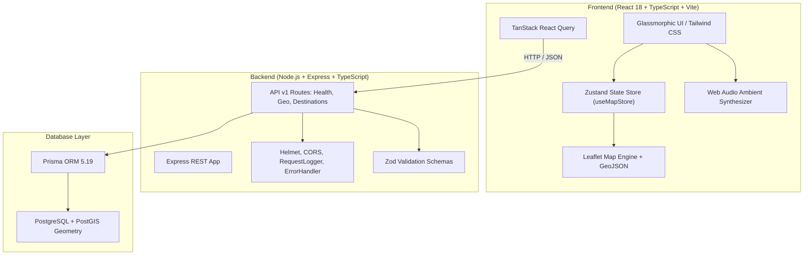

# ExploreBD (আমার বাংলাদেশ) 🇧🇩
### Next-Generation Geospatial Tourism & Heritage Platform for Bangladesh

[](https://nodejs.org/)
[](https://react.dev/)
[](https://www.typescriptlang.org/)
[](https://vitejs.dev/)
[](https://tailwindcss.com/)
[](https://leafletjs.com/)
[](https://www.prisma.io/)
[](https://www.postgresql.org/)
[](https://vitest.dev/)
[](#-testing--quality-assurance)
[](LICENSE)

---

## 📖 Overview

**ExploreBD** is a map-centric, immersive exploration and heritage preservation platform engineered for Bangladesh. Designed with glassmorphic aesthetics, ultra-fluid animations, and rigorous geospatial data, ExploreBD connects travelers, historians, and researchers to Bangladesh's rich ecological wonders, ancient archaeological sites, Mughal forts, Buddhist viharas, and living cultural traditions.

The platform combines an interactive GIS map canvas with authentic archival citations, primary epigraphic records, curated regional trails, a multi-day trip planner, verified local guide marketplace, 360° virtual audio-visual tours, and a gamified community submission portal.

---

## 🌟 Key Features

### 🗺️ 1. Interactive Geospatial Surface & Multi-Layer GIS
- **Multi-Style Base Map Engine**: Seamlessly toggle between **Topographic/Humanitarian OSM**, **Standard OpenStreetMap**, and **Esri High-Resolution Satellite Imagery**.
- **Geographical Constraints & Bounding**: WGS84 coordinates bounded strictly to Bangladesh (`[20.5°N, 88.0°E]` to `[26.7°N, 92.7°E]`) with smooth fly-to camera animations.
- **Administrative Boundary Overlays**: Real GeoJSON polygons for all **8 Administrative Divisions** (Dhaka, Chittagong, Sylhet, Rajshahi, Khulna, Barishal, Rangpur, Mymensingh).
- **Dual Visual Taxonomy**:
  - 🌲 **Nature & Wild (Emerald Theme)**: Mangroves, hill tracts, freshwater swamps, waterfalls, and coral beaches.
  - 🏛️ **Archaeology & Heritage (Amber Theme)**: Buddhist monasteries, Sultanate mosques, Mughal fortifications, and terracotta temples.
- **Live Spatial Telemetry**: Interactive cursor coordinate readout displaying latitude and longitude in real time.

---

### 🏛️ 2. Comprehensive Destination Profiles & Archival Integrity
ExploreBD features **18 deeply researched, authentic landmarks** representing all 8 administrative divisions:

| Division | Landmark | Bengali Name | Classification | Historical / Natural Highlight |
|---|---|---|---|---|
| **Dhaka** | **Ahsan Manzil** | আহসান মঞ্জিল | Heritage / Palace | The Pink Palace; seat of the Nawabs of Dhaka; foundation of All India Muslim League (1906) |
| **Dhaka** | **Lalbagh Fort** | লালবাগ কেল্লা | Heritage / Fort | 17th-century Mughal fortress commissioned by Prince Muhammad Azam; Tomb of Pari Bibi |
| **Dhaka** | **Sonargaon & Panam City** | সোনারগাঁও ও পানাম নগর | Heritage / Historic City | Ancient medieval capital of Bengal and Isa Khan's Baro-Bhuiyan stronghold |
| **Khulna** | **Sixty Dome Mosque** | ষাট গম্বুজ মসজিদ | UNESCO World Heritage | 15th-century Sultanate brick architecture founded by Khan Jahan Ali in Bagerhat |
| **Khulna** | **Sundarbans Mangrove** | সুন্দরবন ম্যানগ্রোভ বন | UNESCO World Heritage | World's largest halophytic tidal mangrove; habitat of the Bengal Tiger (*Panthera tigris*) |
| **Rajshahi** | **Somapura Mahavihara** | সোমপুর মহাবিহার | UNESCO World Heritage | 8th-century Buddhist monastery built by King Dharmapala of the Pala Empire |
| **Rajshahi** | **Mahasthangarh** | মহাস্থানগড় | Ancient Archaeological City | Ancient *Pundranagara* (3rd century BCE); Mauryan Brahmi limestone inscription site |
| **Rajshahi** | **Puthia Temple Complex** | পুঠিয়া রাজবাড়ি ও মন্দির | Heritage / Temple Cluster | Highest concentration of historic terracotta temples in Bangladesh (Govinda Temple) |
| **Chittagong** | **Sajek Valley** | সাজেক ভ্যালি | Nature / Hill Tract | "Kingdom of Clouds" nestled in the Kasalong range of Rangamati Hill Tracts |
| **Chittagong** | **Cox's Bazar Beach** | কক্সবাজার সমুদ্র সৈকত | Nature / Coastal Beach | World's longest continuous unbroken natural sand beach (120 km) |
| **Chittagong** | **Saint Martin's Island** | সেন্ট মার্টিন্স দ্বীপ | Nature / Coral Island | *Narikel Jinjira*; Bangladesh's sole coral-reef marine ecosystem |
| **Sylhet** | **Ratargul Swamp Forest** | রাতারগুল জলাবন | Nature / Swamp Forest | Freshwater swamp forest populated by *Millettia pinnata* and swamp submerged canopies |
| **Sylhet** | **Sreemangal Tea Route** | শ্রীমঙ্গল ও লাউয়াছড়া | Nature / Tea Capital | Tea plantations, rainforests, and critically endangered Western Hoolock Gibbons |
| **Barishal** | **Kuakata Sea Beach** | কুয়াকাটা সমুদ্র সৈকত | Nature / Coastal Beach | *Sagor Konna* (Daughter of the Sea); panoramic sunrise and sunset over the Bay of Bengal |
| **Rangpur** | **Kantajew Temple** | কান্তজীউ মন্দির | Heritage / Terracotta Temple | 18th-century Navaratna terracotta temple depicting the epic of *Ramayana* |
| **Rangpur** | **Tajhat Palace** | তাজহাট রাজবাড়ী | Heritage / Zamindar Palace | Neoclassical palace built by Maharaja Kumar Gopal Lal Roy |
| **Mymensingh** | **Birishiri & Durgapur** | বিরিশিরি ও সুসং দুর্গাপুর | Nature / Ceramic Lake | Turquoise ceramic lake, Garo indigenous cultural heritage, and Someshwari River |
| **Mymensingh** | **Shashi Lodge** | শশী লজ (মুক্তাগাছা) | Heritage / Rajbari | Greek-revival palace of the Muktagacha Zamindars with historic Venus statue |

- **Primary Epigraphs & Inscriptions**: Detailed translations and scripts (e.g. *Mauryan Brahmi* stone slab of Mahasthangarh, 1752 CE Sanskrit *Kantajew Foundation Plaque*).
- **Archival Citations**: References to Imperial Firmans, Archaeological Survey of India (ASI) reports, UNESCO World Heritage Centre dossiers, and official Government gazette notifications.
- **Logistics Breakdown**: Multi-tier entry ticket pricing (Domestic, SAARC, Foreigner), season/weather ratings, opening schedules, and complete transportation routes (Air, Train, Road, Water/Launch).

---

### 🧭 3. Curated Thematic Trails
ExploreBD features 4 thematic travel circuits with synchronized map polyline routes and automatic camera focus:
1. 🕌 **Mughal Heritage Trail**: Old Dhaka → Lalbagh Fort → Ahsan Manzil → Panam City Sonargaon.
2. ☸️ **Buddhist Archaeology Circuit**: Somapura Mahavihara (Paharpur) → Mahasthangarh (Bogra) → Mainamati (Comilla).
3. 🍃 **Sylhet Tea & Cloud Forests**: Sreemangal Tea Estates → Lawachara Rainforest → Ratargul Swamp → Jaflong Stone Valley.
4. 🐅 **Sundarbans Delta Adventure**: Mongla Port → Kotka Wildlife Sanctuary → Hiron Point → Bagerhat Sixty Dome Mosque.

---

### 🎧 4. 360° Virtual Tour with Ambient Soundscape
- **Interactive Panorama**: 360-degree drag rotation, perspective manipulation, zoom controls, and orientation compass.
- **Synthesized Ambient Soundscape**: Procedural audio engine built on the **Web Audio API** delivering real-time natural breeze and foliage sound synthesis without external audio files.
- **Architectural Hotspots**: Interactive spatial pins highlighting structural details, domes, terracotta tiles, and historical notes.

---

### 🎒 5. Multi-Day Itinerary Planner & Guide Marketplace
- **Custom Milestone Builder**: Add, reorder, and remove daily milestones with travel duration estimates and region-based map fly-to transitions.
- **Verified Local Guide Directory**: Browse certified regional guides with hourly rates, languages spoken, traveler reviews, and specialty badges (e.g. *Archaeology*, *Mangrove Navigation*, *Sylhet Trekking*).
- **Dynamic Cost Calculator**: Instant breakdown of guide fees, logistics, transport, and heritage entry permits.

---

### 👤 6. Contributor Portal & Gamification
- **Bento Grid Dashboard**: User verification badges, contact information, and security settings.
- **Gamified Explorer Progress**: Track historical validations, landmark photo approvals, community awards, and interactive contributor level sliders.
- **Contribution Feed**: Review submitted locations with real-time statuses (`Approved`, `Pending`, `In-Review`) and earned explorer points.
- **Saved Itineraries**: One-click recall of saved multi-day expeditions.

---

### ✍️ 7. 5-Step Community Spot Submission Wizard
A guided modal allowing certified contributors to submit undocumented heritage or nature sites:
1. **Basics**: Name, Bengali script title, division, district, and exact coordinates.
2. **Heritage & Era**: Reign/dynasty, architectural classification, historical significance, and UNESCO status.
3. **Timeline & Media**: Visual timeline builder, photo/drone upload preview, and orientation controls.
4. **Archival Records**: Primary inscriptions, ancient manuscripts, and historical repository references.
5. **Review & Gamified Submission**: Final review earning **+150 community explorer points**.

---

### ⚡ 8. Omni-Search & Serendipity Discovery
- **Modal Search (`Ctrl + K` / `Cmd + K`)**: Instant search across titles, Bengali names, eras (e.g., *Pala*, *Mughal*, *Sultanate*), architectural styles, districts, and tags with keyboard navigation.
- **"Take Me Somewhere" Serendipity Button**: Random landmark discovery engine that automatically pans and zooms the camera to a surprise destination.
- **Division Navigation Bar**: Floating glass capsule providing one-tap filtering across all 8 administrative divisions.

---

## 🏗️ Architecture & Technology Stack



### Stack Details

| Layer | Technologies |
|---|---|
| **Frontend Core** | React 18.3, TypeScript 5.5, Vite 5.3 |
| **Mapping & GIS** | Leaflet 1.9, Mapbox GL JS 3.5, GeoJSON, WGS84 Spatial Projections |
| **Styling & Icons** | Tailwind CSS 3.4, PostCSS, Lucide React, Glassmorphism, Google Fonts (`Cinzel`, `Outfit`, `Plus Jakarta Sans`) |
| **State Management** | Zustand 4.5 |
| **Data Fetching** | TanStack React Query 5.50 |
| **Audio Engine** | Web Audio API (Synthesized Brown/Pink Noise Wind Simulator) |
| **Backend Framework** | Node.js, Express 4.19, TypeScript, tsx watch |
| **Security & Middleware**| Helmet 7.1, CORS, Custom Structured Error Handling |
| **Validation & Types** | Zod 3.23 |
| **Database & ORM** | PostgreSQL 14+ with PostGIS, Prisma ORM 5.19 |
| **Testing** | Vitest 1.6, Testing Library (React & DOM), Supertest 7.0 |

---

## 📁 Repository Structure

```text
travel-bangladesh/
├── .env.example              # Central environment variable template
├── package.json              # Monorepo workspaces definition (frontend, backend)
├── package-lock.json
├── README.md                 # Complete project documentation
│
├── backend/                  # REST API Backend
│   ├── package.json
│   ├── tsconfig.json
│   ├── vitest.config.ts
│   ├── prisma/
│   │   └── schema.prisma     # Prisma data schema (PostGIS, Destinations, Users)
│   ├── src/
│   │   ├── app.ts            # Express application factory & middleware pipeline
│   │   ├── server.ts         # Server entrypoint with graceful shutdown
│   │   ├── config/
│   │   │   ├── env.ts        # Zod-validated environment configurations
│   │   │   └── prisma.ts     # Global Prisma client instance
│   │   ├── middlewares/
│   │   │   ├── error.middleware.ts    # Central error handler with Zod & AppError support
│   │   │   └── logging.middleware.ts  # HTTP request logging middleware
│   │   └── routes/
│   │       ├── index.ts               # Root API v1 router
│   │       └── health.routes.ts       # Healthcheck & uptime endpoints
│   └── tests/
│       └── health.test.ts    # Supertest integration tests for health endpoints
│
└── frontend/                 # Interactive React & GIS Frontend
    ├── index.html            # Entry HTML with custom typography & metadata
    ├── package.json
    ├── postcss.config.js
    ├── tailwind.config.js    # Custom brand color palette & animations
    ├── tsconfig.json
    ├── vite.config.ts
    ├── vitest.config.ts
    └── src/
        ├── main.tsx          # React application root
        ├── App.tsx           # Primary layout, modal manager & view switcher
        ├── index.css         # Glassmorphic utilities, custom scrollbars, toggles
        ├── vite-env.d.ts
        ├── components/
        │   ├── account/
        │   │   └── MyAccountView.tsx      # User profile, gamification & submissions
        │   ├── common/
        │   │   ├── DivisionBar.tsx        # Floating capsule for 8 divisions
        │   │   ├── Navbar.tsx             # Main header with search, breadcrumb & tools
        │   │   ├── SearchModal.tsx        # Full-text fuzzy search modal (Ctrl+K)
        │   │   └── VirtualTourModal.tsx   # 360° tour with Web Audio soundscape
        │   ├── map/
        │   │   ├── DestinationDrawer.tsx  # Detailed factsheet drawer with tabs
        │   │   ├── LeftFilterPanel.tsx    # Layer toggles & thematic trail selector
        │   │   └── MapCanvas.tsx          # Leaflet GIS canvas, tiles & markers
        │   ├── planner/
        │   │   └── PlannerView.tsx        # Multi-day itinerary builder & guide booking
        │   └── submission/
        │       └── SubmitSpotModal.tsx    # 5-step community landmark submission wizard
        ├── data/
        │   ├── bangladeshGeoData.ts       # GeoJSON division boundaries & trails
        │   └── mockData.ts                # Curated dataset of 18 authentic POIs
        ├── store/
        │   └── useMapStore.ts             # Central Zustand store & actions
        ├── types/
        │   └── index.ts                   # TypeScript interfaces & domain models
        └── tests / test suites/
            ├── App.test.tsx               # Root render and layout tests
            ├── BangladeshHeritage.test.tsx# Heritage data, UNESCO & inscription tests
            ├── Interactions.test.tsx      # User workflows, tabs, and planner actions
            ├── RealMap.test.tsx           # Leaflet map, styles & GIS coordinate tests
            ├── Responsive.test.tsx        # Viewport responsiveness & mobile tests
            └── Views.test.tsx             # Extended views & modal validation tests
```

---

## 🚀 Quick Start & Installation

### 1. Prerequisites
- **Node.js**: v18.0.0 or higher
- **npm**: v9.0.0 or higher
- *(Optional for full database persistence)*: **PostgreSQL 14+** with **PostGIS** extension

---

### 2. Environment Configuration
Create a `.env` file in the project root:
```bash
cp .env.example .env
```

Default configuration in `.env.example`:
```env
# Backend Configuration
PORT=5000
NODE_ENV=
CLIENT_URL=http://localhost:5173
DATABASE_URL=
JWT_SECRET=
JWT_EXPIRES_IN=

# Frontend Configuration
VITE_API_URL=
VITE_MAPBOX_TOKEN=
```

---

### 3. Install Dependencies
Because this repository uses **npm workspaces**, you can install all dependencies across both `frontend` and `backend` in a single command from the project root:

```bash
npm install
```

---

### 4. Database Setup (Backend)
Generate the Prisma Client:
```bash
# From root
npm run dev:backend

# Or directly in backend/
cd backend
npx prisma generate
```

*(If running with a local PostgreSQL instance)*:
```bash
cd backend
npx prisma migrate dev --name init
```

---

### 5. Running the Application

#### Option A: Run Both Services Simultaneously (Recommended)
From the project root:
```bash
npm run dev
```

#### Option B: Run Services Separately
**Backend Server** (Port 5000):
```bash
npm run dev:backend
# API running at: http://localhost:5000
# Health check: http://localhost:5000/health
```

**Frontend Application** (Port 5173):
```bash
npm run dev:frontend
# App running at: http://localhost:5173
```

---

## 🧪 Testing & Quality Assurance

ExploreBD includes an automated test suite with **38 unit and integration tests** verifying geospatial calculations, heritage documentation, user interactions, and API health.

### Run All Tests
```bash
npm test
```

### Run Type Checking
Validate strict TypeScript compilation across the entire monorepo:
```bash
npm run typecheck
```

### Test Suite Breakdown

| Test Suite | File | Tests | Validated Functionality |
|---|---|---|---|
| **Heritage & Archival Data** | `BangladeshHeritage.test.tsx` | 6 | All 8 divisions represented; UNESCO dossiers verified; Mauryan Brahmi & Sanskrit inscriptions; archival document citations; division switcher |
| **Interactive Map & GIS** | `RealMap.test.tsx` | 6 | Leaflet WGS84 canvas rendering; map style switching (Topography, Standard, Satellite); zoom controls; GeoJSON boundaries; thematic trails |
| **UI Workflows & Store** | `Interactions.test.tsx` | 7 | Itinerary builder additions; guide booking triggers; image lightbox preview; custom day creations; store synchronization |
| **Responsive Layouts** | `Responsive.test.tsx` | 8 | Mobile drawer drag indicators; tablet search transitions; drawer collapse & expand; modal scroll behaviors |
| **Views & Gamification** | `Views.test.tsx` | 3 | Account profile summary, gamification levels, contributor feed; 5-step spot submission modal; planner cart summary |
| **Application Integration**| `App.test.tsx` | 4 | Root layout rendering; navigation bar; map canvas; overlay management |
| **Backend REST Health** | `health.test.ts` | 4 | `/health`, `/api/health`, `/api/v1` metadata, and 404 response formats |

---

## 📡 API Specification

The backend REST service serves endpoints under `/api/v1`:

### Health Endpoints
- `GET /health` — Service health, uptime, and timestamp.
- `GET /api/health` — Alias health check endpoint.
- `GET /api/v1` — Root API metadata and registered resource index.

```json
{
  "name": "ExploreBD API",
  "version": "v1",
  "description": "Map-centric tourism and heritage platform for Bangladesh",
  "endpoints": {
    "health": "/api/v1/health",
    "geo": "/api/v1/geo",
    "destinations": "/api/v1/destinations",
    "heritage": "/api/v1/heritage",
    "itineraries": "/api/v1/itineraries",
    "auth": "/api/v1/auth"
  }
}
```

---

## 🗺️ Database & Spatial Schema

The PostgreSQL database is managed via Prisma ORM (`backend/prisma/schema.prisma`):

- **`Division`**: Administrative divisions of Bangladesh with geographic centroids (`name`, `bnName`, `latitude`, `longitude`).
- **`District`**: 64 administrative districts categorized under divisions.
- **`Category`**: Visual and topical categories (`NATURE`, `HERITAGE`, `CULTURE`, `COMMUNITY`).
- **`Destination`**: Primary POI table containing WGS84 coordinates, summary, chronicles, admission rates, difficulty, and gallery arrays.
- **`HeritageDetail`**: One-to-one extension containing dynastic era, architectural style, UNESCO status (`WORLD_HERITAGE_SITE`, `TENTATIVE_LIST`, `NOT_LISTED`), verification status, primary inscriptions, and archival source citations.
- **`User`**: Explorer and contributor profiles with role-based access (`EXPLORER`, `CONTRIBUTOR`, `MODERATOR`, `ADMIN`).
- **`Itinerary` & `ItineraryItem`**: Multi-day trip schedules, ordered waypoint sequences, notes, and transit modes.

---

## ⌨️ Keyboard Shortcuts & Gestures

| Key / Gesture | Action |
|---|---|
| `Ctrl + K` or `Cmd + K` | Open Universal Search Modal |
| `Escape` | Close Search, Modal, or Lightbox Preview |
| `↑` / `↓` + `Enter` | Navigate and select destinations within Search results |
| **Click & Drag** | Rotate 360° Virtual Tour view or pan the GIS map |
| **Scroll Wheel / Pinch** | Zoom in / out on the map and 360° virtual tour |

---

## 🏛️ Acknowledgements & Sources

Historical information, epigraphic texts, and architectural research featured in ExploreBD are curated from:
- **Department of Archaeology, Ministry of Cultural Affairs, Bangladesh**
- **UNESCO World Heritage Centre** (Dossier No. 321, 322, 798)
- **The Asiatic Society of Bangladesh** (*Banglapedia: National Encyclopedia of Bangladesh*)
- **Archaeological Survey of India (ASI)** historical reports
- **OpenStreetMap contributors** and **Esri World Imagery**

---

## 📄 License

This project is licensed under the **MIT License** — see the [LICENSE](LICENSE) file for details.


## 👨🏼‍💻 Author

GitHub: 10bitsofwalid

Gmail: [walidrahman.officials@gmail.com]